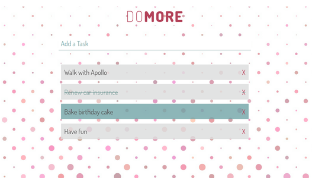

# Do More

### Todo app with Node, Express, and MongoDB

This app was created as a part of [The Advanced Web DeveloperBootcamp by Colt Steele, Udemy](https://www.udemy.com/the-advanced-web-developer-bootcamp/learn/v4/overview)

As in every todo app, you can **Add**, **Mark as Complete**, and **Delete** your tasks.

#### Stack:

NODE.JS

EXPRESS.JS

MONGODB

